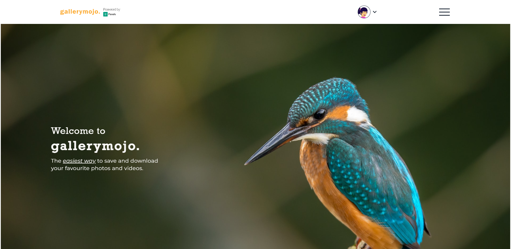
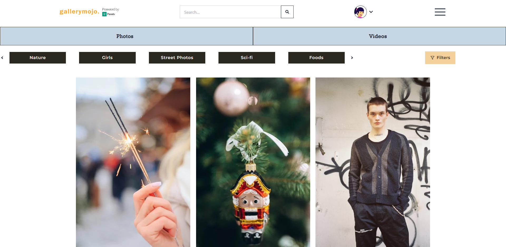
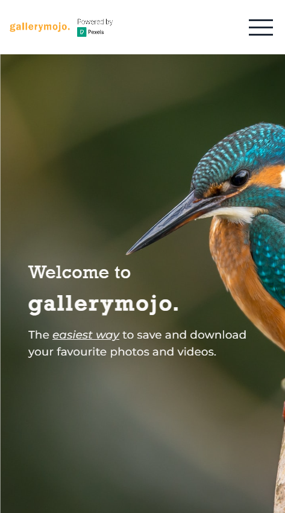
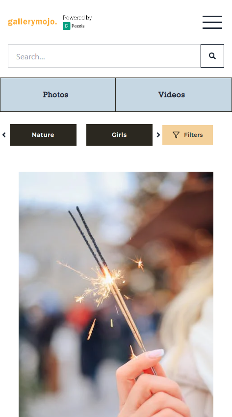

# gallerymojo.

A ReactJS web application that provide the photos and videos which are shared by talented photographers. This web application is powered by [PexelsAPI](https://www.pexels.com/api/documentation/) for educational purpose.

## Preview Images

### Desktop

**Home Page**

**Explore Page**

### Mobile

|                 Home Page                 |                  Explore Page                   |
| :---------------------------------------: | :---------------------------------------------: |
|  |  |

## Major Technologies

- ### ReactJS
  - ReactJS library is used to build the web app.
- ### React Router DOM v6
  - React router dom is used to navigate efficiently through web app.
- ### REDUX Toolkit
  - RTK is used for state managements for data from API and user information.
- ### Firebase
  - Firebase is used for user's authentication and storing user's data.
- ### TailwindCSS
  - TailwindCSS is used for styling and for more styling components, [DasiyUI](https://daisyui.com/) is used.

## Installation in local

### `npm install`

Installs the required packages by NodeJS.

### `npm start`

Runs the app in the development mode.\
Open [http://localhost:3000](http://localhost:3000) to view it in your browser.

## Live demo site

https://gallerymojo.netlify.app/
